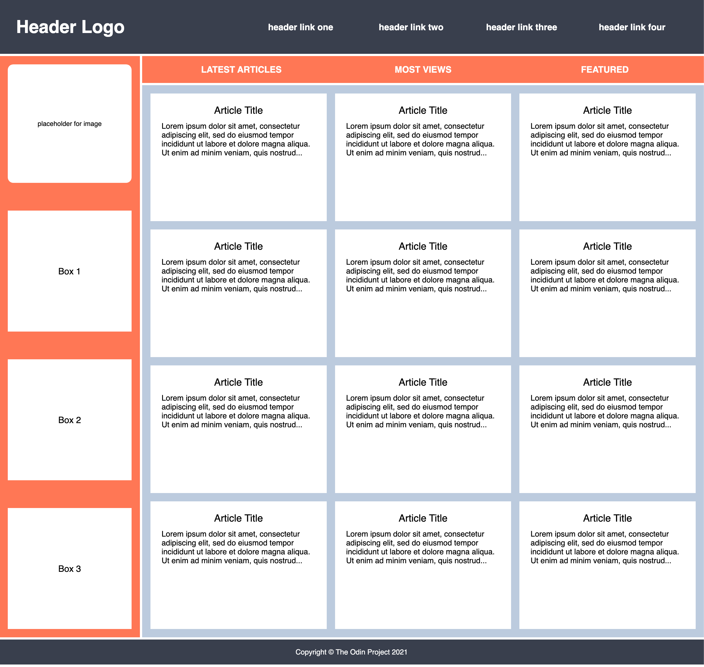

# Holy Grail Mockup with Grid

This Holy Grail layout is a bit more complicated with some more features. Using Flexbox on some areas like the navbar might be tempting, but for the sake of this practice assignment, I will try to recreate this entire mockup using only Grid.

## Desired Outcome

### Self Check
- The container element has two columns
- The container's second column is 4 times larger than the first column
- The container element has a gap of 4px
- The header element has two columns
- The `ul` inside the menu element contains another grid
- The `ul` inside the nav element contains another grid
- The sidebar element has a gap of 50px
- The text elements in the sidebar are centered with grid
- The article element should set grid columns using `repeat` along with the `auto-fit` and `minmax` properties
- The article columns should have a minimum value of 250px and a maximum of 1fr unit
- The article element has a gap of 15px
- The card elements inside the article container have a height of 200px
- The header and footer span across both columns
- The sidebar only spans across the first column
- The nav and article elements only span across the second column
